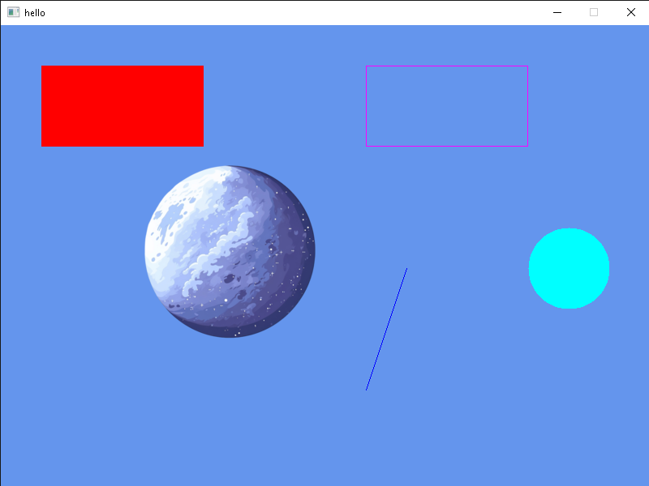

## ✨ Features

Organized by development status:

### ✅ Currently Available
- 🪟 **Window Creation**  
  Simple window management using SDL3  

- 🖼️ **Image Loading & Rendering**  
  Load textures from files and draw them in your window  

- 🎨 **Color System (`AyurColor`)**  
  Define colors using RGBA values (predefined colors like `Red`, `Green`, `Blue` coming soon)  

- 🔷 **Shapes Rendering**  
  - Rectangles (filled or outlined)  
  - Lines  
  - Circles (filled)  

- 🎮 **Basic Event System**  
  `AyurEvent` with quit event support (more coming soon)  

---

### 🛠 In Progress
- 🌈 **Simpler Color Creation**  
  Predefined color constants (e.g., `AyurColor.Red`)  

- 🖱️ **Expanded Event Types**  
  Keyboard, mouse, and more  

- 🔺 **Additional Shapes**  
  Triangles, polygons, and more primitives  

---

### 🌱 Future Features

#### 🎮 Game & Creative Coding
- 🎞️ **Animation System**  
  - Math-based animations (tweening, smooth transitions)  
  - Sprite animation helpers for texture animation  

- 💡 **Shader Support**  
  Ability to use custom fragment & vertex shaders (planned)  

- 🧩 **Creative Coding Features**  
  Inspired by **Processing**, **p5.js**, and similar frameworks  

#### 🛠 Tools & Platform
- 🧠 **Input Handling**  
  Full keyboard, mouse, and gamepad support with remapping  

- 🌐 **Cross-Platform Improvements**  
  Better Linux and macOS support  

---

## 📦 Requirements
- [.NET 8 SDK](https://dotnet.microsoft.com/en-us/download)  
- C# IDE (e.g. Visual Studio, VS Code)  
- SDL3 (already handled via C# wrapper, no native setup needed)  

---

## 🧪 Example
Check [`./Program.cs`](./AyurCsharp/Program.cs) for a full example of using **window creation, events, image rendering, and shapes**.  

---

## 🖼️ Showcase

Here’s a snapshot (`Res/Hello.png`) showing all currently available rendering features:  

  
